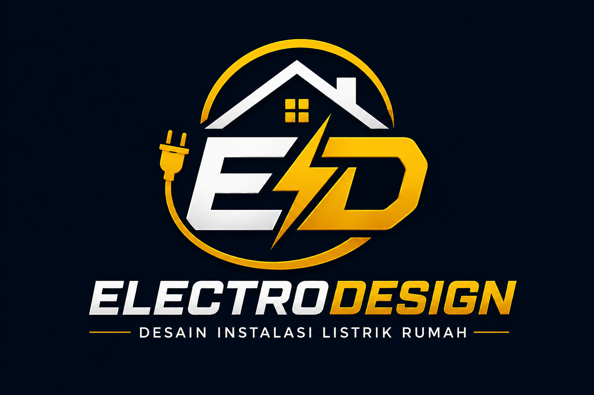
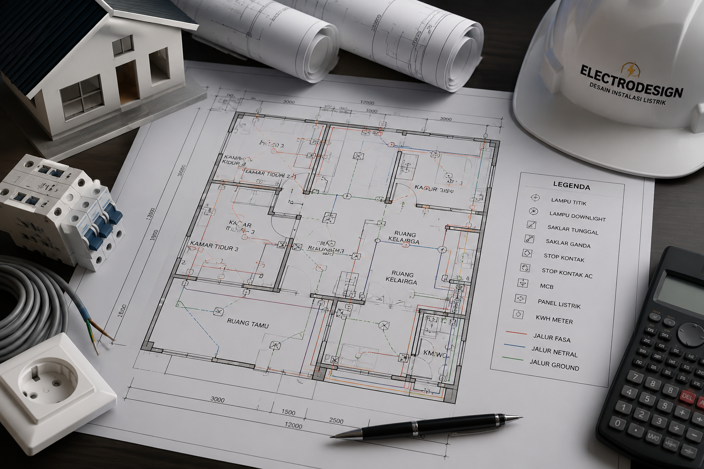
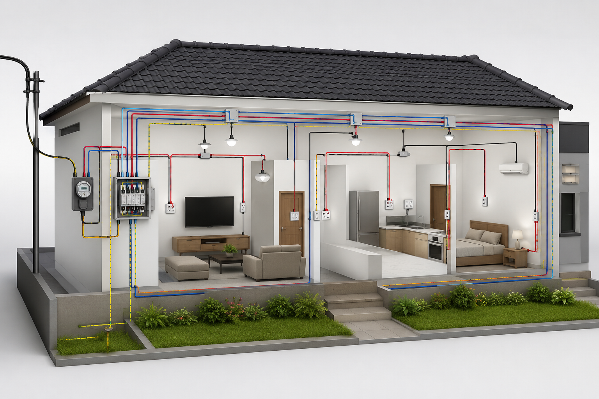
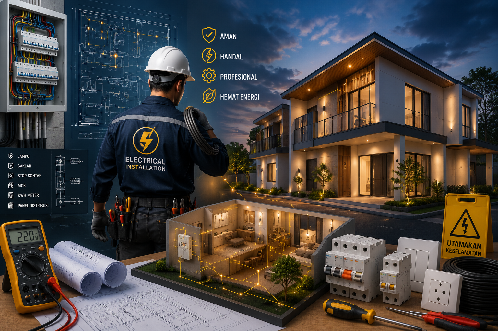
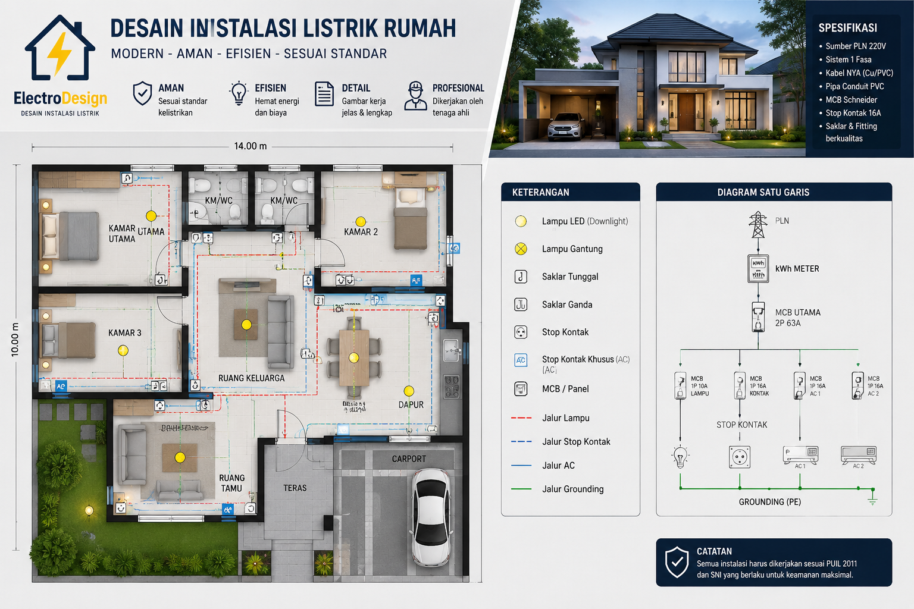

# tugasakhir-satriyoega-251011750112.github.io
<!DOCTYPE html>
<html lang="id">

<head>
    <meta charset="UTF-8">
    <meta name="viewport" content="width=device-width, initial-scale=1.0">
    <title>ElectroDesign - Desain Instalasi Listrik Rumah</title>

    
</head>

<body>

    <!-- NAVBAR -->
    <nav class="navbar">
        

            

            <h2>ELECTRODESIGN</h2>
        

        <ul class="menu">
            <li><a href="#home">Home</a></li>
            <li><a href="#tentang">Tentang</a></li>
            <li><a href="#kontak">Kontak</a></li>
        </ul>
    </nav>

    <!-- HERO -->
    <section id="home" class="hero">

        

            

                

                

                    <h2>ELECTRODESIGN</h2>
                    
DESAIN INSTALASI LISTRIK RUMAH

                

            

            <h1>
                JASA PEMBUATAN  
                DESAIN INSTALASI  
                LISTRIK RUMAH
            </h1>

            

                Desain tepat, instalasi aman, rumah nyaman dan hemat energi.
            

            <a href="#kontak" class="btn">
                Konsultasi Gratis
            </a>

        

        

            

            

            

        

    </section>

    <!-- TENTANG -->
    <section id="tentang" class="konsultasi">

        

            <h2>Tentang Kami</h2>
        

        

            

                
            

            

                

                    ElectroDesign adalah jasa pembuatan desain instalasi listrik rumah
                    yang berfokus pada keamanan, efisiensi, dan kenyamanan setiap hunian.
                    Kami membantu merancang sistem kelistrikan mulai dari jalur instalasi,
                    penempatan titik lampu, stop kontak, saklar, hingga perhitungan kebutuhan
                    daya listrik sesuai kebutuhan rumah Anda.
                

                 

                

                    Setiap desain dibuat secara rapi, terstruktur, dan mengikuti standar
                    kelistrikan yang berlaku sehingga proses pemasangan menjadi lebih mudah,
                    aman, serta mengurangi risiko gangguan listrik di masa mendatang.
                    Dengan tenaga yang berpengalaman, ElectroDesign siap memberikan solusi
                    terbaik untuk kebutuhan instalasi listrik rumah Anda.
                

            

        

    </section>

    <!-- KONSULTASI -->
    <section id="kontak" class="konsultasi">

        

            <h2>Konsultasi Gratis</h2>
            

                Isi formulir berikut dan kami akan segera menghubungi Anda.
            

        

        <form class="form-konsultasi" action="https://formsubmit.co/satriyoega7@gmail.com" method="POST">

            <input type="hidden" name="_subject" value="Konsultasi Baru ElectroDesign">

            <input type="hidden" name="_captcha" value="false">
            <input type="hidden" name="_template" value="table">

            <input type="hidden" name="_next" value="https://satriyoidebisnis.netlify.app/#kontak"> <input type="text"
                id="nama" name="nama" placeholder="Nama Lengkap" autocomplete="name" required>

            <input type="tel" id="wa" name="whatsapp" placeholder="Nomor WhatsApp" autocomplete="tel" required>

            <input type="email" id="email" name="email" placeholder="Alamat Email" autocomplete="email">

            <select name="layanan" required>
                <option value="">Pilih Layanan</option>
                <option>Desain Instalasi Rumah</option>
                <option>Perhitungan Kebutuhan Daya</option>
                <option>Gambar Kerja Instalasi</option>
                <option>Paket Lengkap Desain Instalasi</option>
            </select>

            <textarea id="pesan" name="pesan" rows="5" placeholder="Jelaskan kebutuhan proyek Anda..."
                required></textarea>

            <button type="submit" id="kirim">Kirim Konsultasi</button>

        </form>

    </section>

    <footer>
        © 2026 ElectroDesign | Desain Instalasi Listrik Rumah
    </footer>

    

    

</body>

</html>
